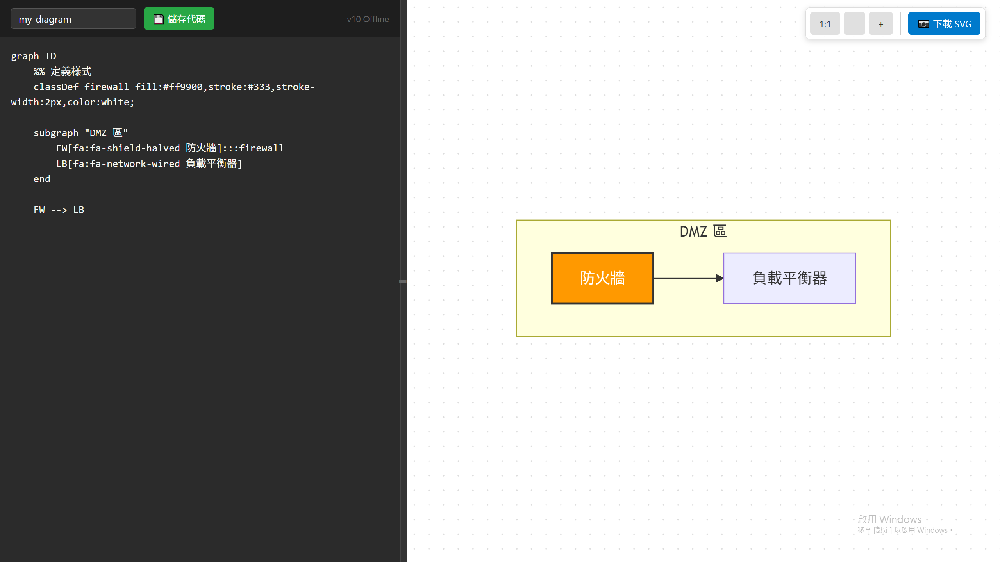

# 🧜‍♀️ Docker Mermaid Studio

**Docker Mermaid Studio** 是一個基於 Docker 與 Nginx 的輕量級、離線版 Mermaid Live Editor。

它專為需要高度隱私（Private Network）與本機開發環境設計，讓你在不依賴外部網路的情況下，也能編寫、預覽並輸出高品質的 Mermaid 流程圖與架構圖。


## ✨ 主要功能 (Features)

* 🔒 **完全離線核心**：使用自行打包的 Mermaid v10 核心 (`mermaid.v10.bundled.js`)，無需網際網路即可渲染圖表。
* 🐳 **Docker 化部署**：透過 `docker-compose` 一鍵啟動，環境乾淨不殘留。
* ↔️ **可拖曳分割視窗**：支援左右拖拉調整「程式碼編輯區」與「預覽區」的寬度。
* 🔍 **強大的預覽功能**：
    * 支援滑鼠滾輪縮放 (Zoom In/Out)。
    * 支援滑鼠拖曳平移 (Pan)。
    * 支援 1:1 還原檢視。
* 💾 **專案管理**：
    * **開啟舊檔**：直接讀取本機 `.mmd` 或 `.txt` 檔案。
    * **儲存原始碼**：將編輯內容下載為 `.mmd` 檔。
    * **輸出 SVG**：高品質向量圖下載，支援自訂檔名。
* 🎨 **Icon 支援**：內建 FontAwesome 整合 (需連網)，可於圖表中加入豐富圖示 (如 AWS/Firewall 圖示)。

## 🛠️ 快速啟動 (Quick Start)

### 前置需求
* [Docker Desktop](https://www.docker.com/products/docker-desktop/) (Windows/Mac/Linux)

### 啟動步驟

1.  **進入專案目錄** (重要：確保你在含有 `docker-compose.yml` 的目錄下)：
    ```bash
    cd path/to/docker-mermaid-studio
    ```

2.  **啟動服務**：
    ```bash
    docker-compose up -d
    ```

3.  **開始使用**：
    打開瀏覽器前往：[http://localhost:8080/index.html](http://localhost:8080/index.html)

4.  **關閉服務**：
    ```bash
    docker-compose down
    ```

## 📂 專案結構 (File Structure)

```text
docker-mermaid-studio/
├── docker-compose.yml       # Docker 啟動設定檔 (定義 Nginx 與 Volume 掛載)
├── index.html               # 主要編輯器介面 (Editor UI)
├── mermaid.v10.bundled.js   # 核心：使用 esbuild 打包的 Mermaid v10 引擎
├── Project/                 # 專案目錄 (存放 .mmd 檔案 及 .svg 檔案)
└── README.md                # 專案說明文件

## 🖌️ 使用範例 (Example)
在左側編輯區輸入以下語法，即可生成帶有圖示的網路架構圖：

```text
graph TD
    %% 定義樣式
    classDef firewall fill:#ff9900,stroke:#333,stroke-width:2px,color:white;
    
    subgraph "DMZ 區"
        FW[fa:fa-shield-halved 防火牆]:::firewall
        LB[fa:fa-network-wired 負載平衡器]
    end
    
    FW --> LB
```


## 🔧 進階：如何自行打包 Mermaid 核心 (Build from Source)
如果你想要更新 Mermaid 版本 (例如 v11)，請依照以下步驟重新打包核心檔案：

安裝相依套件 (需安裝 Node.js)：

```Bash
npm install mermaid esbuild
```

建立入口檔案 input.js：

```JavaScript
import mermaid from 'mermaid';
window.mermaid = mermaid;
```

執行打包指令：

```Bash
npx esbuild input.js --bundle --minify --format=iife --outfile=mermaid.v10.bundled.js
```
完成後，將生成的 .js 檔覆蓋專案中的舊檔即可。

## 📝 License
本專案採用 MIT License。 Mermaid.js 核心版權歸原作者所有。

---
Generated for Docker Mermaid Studio
